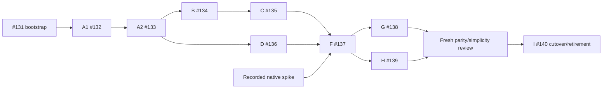

# Migration responsibility and parity map

Parity is against Python commit
`b3f61a96c40401722ec16fc361958d1690982e02`
(tree `7e061c9314d16785c070483799d0e8057a42ba31`), fixed by
[#130](https://github.com/faviann/broodling/issues/130). Read baseline source and
test paths below at that revision. A fresh, analysis-only agent inspected these
responsibilities before behavioral implementation. The #131 .NET landing zone
is infrastructure, not migrated application behavior.

[Current scope](../governing/current.md) governs product responsibility;
production source and tests establish implemented behavior. Preserve semantic
authority, durability and meaningful refusals. Python APIs/database history,
old-data import and remaining #100 features are excluded.

## Prerequisites and native route

The [baseline validation record](130-baseline-validation.md) distinguishes
#131's reported exact-baseline run, the independent 22 September rerun
(404 passed, no skips), and later spike evidence.

The [native investigation](https://github.com/faviann/broodling/issues/130#issuecomment-5776348033)
supports C# → narrow Python transport → pinned SDK inside F (#137). Adopt this
route; do not merge the disposable spike wholesale or build a general .NET SDK.
Its fourteen scenarios comprise twelve released SDK/native checks with a
controlled provider and two stub-SDK cases. Real DirectTarget PR delivery was
not exercised. C# owns policy, credentials, authority, conflict recovery and
receipt validation; Python only translates calls/results and owns no store.

## Slice map

Paths are under `broodling/` and `tests/` unless qualified. Witnesses identify
representative boundaries, not an instruction to mechanically translate tests.
Keep detailed failures at the owning boundary and compose a few application
paths using real SQLite/Git where their behavior matters.

| Slice | Python responsibility | Representative baseline witnesses | Required invariant and application ownership |
| --- | --- | --- | --- |
| [A1 #132](https://github.com/faviann/broodling/issues/132) | `identity.py`, `entitlement.py`, store/schema identity and source operations | `test_work_reference_properties.py`, `test_work_unit_identity.py`, `test_entitlement.py`, `test_schema.py` | Canonical references converge without aliasing; upstream IDs pin once atomically. Exact bytes/digests/provenance and immutable source identity survive reopen. Explicit initialization only; ordinary open refuses missing/unrecognized/incompatible state. Callable identity/source inspection and initialize/upgrade operator handling. |
| [A2 #133](https://github.com/faviann/broodling/issues/133) | `contract.py`, `closability.py`, `delivery.py`, source-neutral `ingress.py`, store decisions | `test_contract_revisions.py`, `test_admission.py`, `test_ingress.py`, `test_crash_recovery.py` | Complete pins, producer and exact caller effects are immutable. Criteria-only admission; preserve unsupported obligations/effects, effect-dependent evidence, unresolved prerequisites and selected-material refusals. A revision without admitted decision grants no authority. Same meaning converges; changed meaning appends lineage. Supplied-source admission → reopen → status/history is an early integrated path. |
| [B #134](https://github.com/faviann/broodling/issues/134) | `starting_state.py`, retention in `git.py`, Attempt admission in store/provisioning | `test_starting_state.py`, `test_attempt_admission.py`, `test_git_retention.py`, admission crash/concurrency in `test_attempt_crash_recovery.py`, B1-after-GC in `test_worktree_provisioning.py` | Retain selected commit and its tree/blob objects before acknowledging Attempt. Attempt/allocation commit together; one current Attempt, original Contract/source/B1 and immutable allocation. Missing objects or conflicting/symbolic retention refs refuse. Owns current-authority checks, basic abandonment and Attempt/B1 observation. |
| [C #135](https://github.com/faviann/broodling/issues/135) | `workspace.py`, `checkout_profile.py`, provisioning/Git helpers | `test_worktree_provisioning.py`, `test_attempt_crash_recovery.py`, `test_checkout_profile.py`, orphan-child witness in `test_retry_crashes.py`, observation contention in `test_invocation.py` | Materialize exact recorded B1; replay uses recorded allocation, not current HEAD. Refuse foreign paths/branches/markers/repositories and unsupported checkout transformations. Separate candidate, common Git and durable state. Independent callers see settled worktree; exclusion survives parent death while a Git child mutates. Owns provisioning and allocated/provisioned observation. |
| [D #136](https://github.com/faviann/broodling/issues/136) | `github_source.py`, GitHub ingress, `deployment/reviewed_issue.py` | `test_github_source.py`, ingress fixture cases, reviewed-source checks in `test_deployment_install.py`, `fixtures/ingress/issue-75.json` and `issue-82.json` | Acquire only named issue; preserve whole response bytes and validate locator/upstream identity. Extra material needs caller grants. Reviewed bytes must match exactly, even after metadata-only changes. Owns non-Python caller-proposal input and accepted/rejected GitHub admission, reusing A2. |
| [F #137](https://github.com/faviann/broodling/issues/137) | `zeroshot_sdk.py`, `codex_profile.py`, launcher, `submission.py`, submit/resume in `invocation.py` | `test_submission.py`, `test_submission_crashes.py`, `test_sdk_policy.py`, `test_codex_profile.py`, `test_gateway_runtime.py`, `test_frozen_instructions.py`, invocation recovery, native spike | Freeze invocation/key; retain dispatch intent before external call and release SQLite writer during it. Duplicate responses converge; source-drift recovery requires unchanged persisted request and validated ownership. Ephemeral credentials; locator/run-only reconnect after correlation. Empty/malformed replies remain unresolved dispatch. Owns full submit/resume and thin operator handling, composing A2/B/C/D. |
| [G #138](https://github.com/faviann/broodling/issues/138) | `disposition.py`, result handling in `invocation.py`, store/schema guards | `test_workflow_result.py`, non-historical binding/cardinality in `test_disposition_foundation.py`, composed invocation completion | Correlated, current Attempt and frozen authority only. Complete matching `v1/pr/opened` receipt with valid non-B1 revision. Result/disposition/current-authority loss commit atomically; read by exact Attempt after reopen without native access. Native failure abandons; transport loss/cancellation detaches; no-effect null output refuses stable disposition. Owns wait/finalize/result inspection and completed handback. |
| [H #139](https://github.com/faviann/broodling/issues/139) | `abandonment.py`, `replacement.py`, store lifecycle transitions | `test_abandonment_foundation.py`, `test_retirement.py`, `test_retry_admission.py`, `test_retry_crashes.py`, `test_retry_races.py`, native stop cases | Abandon before stop; never redispatch abandoned work to find a run. Every dispatched Attempt stays quarantined, including success/force-stop. Retirement requires exact safe never-dispatched ownership; explicit replacement requires completed retirement, new allocation, original Contract/source/B1 and frozen target. Owns stop, retirement/retry and abandonment handback. |

`test_store_state_machine.py` adds generated immutable-admission, repeat,
restart, current-Attempt and irreversible-abandonment witnesses. It does not
replace real Git/process checks.

A1's .NET witnesses are `tests/Broodling.Tests/IdentityTests.cs`,
`SourceCustodyTests.cs` and `StoreLifecycleTests.cs`: real SQLite replay/reopen,
canonical non-aliasing, once-only pins and rollback, concurrent writers, immutable
bytes/provenance and state refusal. The [A1 implementation reference](../implementation/dotnet-identity-custody.md)
records the callable API, direct-SQLite decision and initial .NET schema boundary.

A2's .NET witnesses are `ContractIngressTests.cs`, `ContractPolicyTests.cs` and
`AdmissionPersistenceTests.cs`: supplied-source admission through reopen and
operator inspection, exact caller authority, optional guidance and preserved
refusals, atomic revision/binding writes, undecided recovery, concurrent decisions
and observation while a real SQLite writer is active. `StoreLifecycleTests.cs`
also checks the deliberate v1→v2 upgrade against actual retained .NET v1 state.
The [A2 implementation reference](../implementation/dotnet-contract-admission.md)
records the API and bounded validation evidence. No GitHub acquisition, Attempt,
native execution or Python state compatibility is implied by that A2 evidence.

B's .NET witnesses are `AttemptAdmissionTests.cs` and `GitCustodyTests.cs`:
real SQLite/Git admission, immutable B1/allocation, current-authority and
abandonment races, exact-revision observation, interrupted-write rollback,
selected-object refusals, permitted ancestor-only loss, retention after GC and
hook/environment/path boundaries. `StoreLifecycleTests` preserves actual v1/v2
facts through explicit schema 3 upgrades. The [B implementation reference](../implementation/dotnet-attempt-allocation.md)
records the APIs, 102-test evidence and C/F/G/H integration obligations. Allocation
does not materialize a checkout. G adds the completed-Work-Unit admission guards
at both the application and SQL boundaries.

C's .NET witnesses are `WorktreeProvisioningTests.cs` and
`ProvisioningProcessTests.cs`: exact recorded B1, unchanged owned candidate
progress on replay, branch-only/lost-acknowledgment and missing-path convergence,
foreign ownership and checkout-policy refusals, real caller SIGKILL with a
surviving Git writer, independent settled callers, abandonment while replay
waits, and status/history during a real provisioning writer. The test-only
process caller also checks selected-child lock handoff, close-only disposal,
unrelated live `Process.Start` exclusion, spawn cleanup and concurrent output
draining. `StoreLifecycleTests` preserves authentic schema-3 Attempt/allocation/
abandonment facts through explicit schema 4 upgrade alongside v1/v2 fixtures.
The [C implementation reference](../implementation/dotnet-worktree-materialization.md)
records the callable `ProvisionAttempt` API, nullable historical provisioning
fact, supported non-PID-1 Linux host, native-library packaging and F/H handoff.
No Python application behavior, native execution or retirement is added here.
The cumulative C run passed 129 .NET tests with no failures/skips; Release build
and local host-publish/shim-loading checks also passed. Python was unchanged.

D's .NET witness is `GitHubAdmissionTests.cs`: controlled CLI acquisition of only
the named issue, exact response bytes, identity/transport refusals, explicit
supplementary grants, reviewed-source byte pins, async caller-authority snapshots
and immutable admission/reopen. Retained #75/#82 fixtures show preserved rejection
and accepted admission without execution. The [D implementation reference](../implementation/dotnet-github-ingress.md)
documents the callable acquisition and non-Python reviewed-source proposal input.

Status/history use coherent per-revision reads without taking the writer slot,
reacquiring sources, calling native services or adding upstream pins.
`test_invocation.py` covers live provisioning contention and identity checks;
`test_cli.py` covers exact material inspection and safe errors. Extend these
operations as facts land; do not defer composition to retirement.

F's .NET witnesses are `NativeDispatchTests`, `DispatchProcessTests`,
`NativeTransportTests`, `NativePolicyTests` and `InvocationTests`: real
SQLite/Git dispatch and correlation authority, six actual caller-death windows,
exact text/binary task material, corrupt acknowledgment refusal, narrow owned
HEAD-drift recovery, credential separation and locator-only native transport.
The C# launcher preserves policy, PID and exact prompt bytes. Controlled-native
replay/conflict/reconnect/detach/stop/null-output checks are distinct from the
stub PR-receipt transport evidence; neither qualifies live PR delivery or
semantic correctness. The [F implementation reference](../implementation/dotnet-native-dispatch.md)
documents complete callable/operator submit/resume, schema 5 and authentic
schema-4 upgrades. Operator configuration and safe-error witnesses preserve the
installed loopback and secret-exclusion boundaries.

The pre-cutover #130 review repair adds the previously omitted existing-target
operator readiness operation from `deployment/check_target.py` and
`test_deployment_target.py`. `TargetReadinessTests` owns selected-container and
runtime-pin checks, credentials/isolation/mount/loopback refusals, hosted UID/GID
probe and native discovery, safe diagnostics and thin command composition.
The [readiness implementation](../implementation/dotnet-target-readiness.md)
records the callable persistence-independent API and small inventory input shared
with the selected invocation origin. Evidence uses controlled process/HTTP
boundaries only; no target lifecycle, real Docker/provider/deployment validation,
or new cleanup authority is implied. This repair precedes #140; fresh combined
migration review is still required before that cutover starts.

G's .NET witnesses are `AttemptCompletionTests`, `CompletionPersistenceTests`,
the authentic schema-5 upgrade in `StoreLifecycleTests`, and one composed
completion path in `InvocationTests`. They retain result/disposition/currentness
atomically, validate exactly seven receipt fields (including string-only ASCII
digit PR IDs without numeric restrictions), recheck frozen invocation authority,
separate native failure from detached waits, and preserve exact historical
Attempt reads after reopen with native unavailable. Schema 6 keeps nonunique
Work Unit result cardinality separately from completed-work admission refusal,
and requires abandonment or completion to justify currentness loss. The
[G implementation reference](../implementation/dotnet-receipt-completion.md)
records store/application wait, thin operator wait, completed submit/resume/
status/history handback, owning witnesses and evidence limits. No-effect stable
success remains refused; controlled receipts prove neither real DirectTarget
delivery nor semantic correctness. H preserves G's guards and schema hashes.

H's .NET witnesses are `RetirementTests`, `ReplacementTests`,
`ReplacementCompletionTests`, `RetirementProcessTests`, the stop handback in `InvocationTests`, and authentic
schema-6 preservation in `StoreLifecycleTests`. They establish abandon-before-stop,
permanent dispatched quarantine, narrow safe proof, exact owned dirty retirement,
lock-inode/child-survival exclusion, removal-before-ack replay, atomic original-B1
replacement, frozen target enforcement and historical-key identity without
restored authority. The [H implementation reference](../implementation/dotnet-retirement-replacement.md)
documents callable stop/retire/retry and thin stop. H integrates after G in
schema 7 with authentic v6 evidence, preserving every completed-work guard and
the exact v1–v6 schema definitions.

## Dependency graph

These edges match the GitHub dependency relationships inspected on 22 September.

All eight behavioral slices and the independent migration-wide review must pass
before I starts. I owns retirement/release guidance, not omitted behavior or
late application wiring. Each implementation receives fresh independent review.

## Risks and deliberate parity boundaries

1. SQLite must preserve atomic authority changes, immutable bindings and
   observation without a writer reservation across concurrent callers/crashes.
   Compare persistence choices against these operations; do not add an ORM
   hierarchy. Native submit/wait/stop cannot hold the SQLite writer.
2. Git administration outlives callers. C/H must preserve child-surviving
   exclusion, sanitized Git environment, suppressed administrative hooks,
   checkout policy and exact path/common-directory ownership. The critical C
   witness resides in `test_retry_crashes.py`; Python file placement is not
   responsibility ownership.
3. Native request conflicts and owned-HEAD-drift conflicts are indistinguishable.
   Existing run ID/error text alone cannot prove safe recovery. Cancellation of
   a waiter is not stop, and terminal status is never physical-cessation proof.
4. Deterministic IDs and serialization may change for new .NET state. Preserve
   supported canonical spellings, non-aliasing, binary source bytes, complete
   attribution, and stable replay. Source pins are unordered; other Contract
   sequences, notes, producer and guidance retain their meaning. Python hash
   fixture strings and historical schema/canonical bytes are not compatibility
   requirements. Native request/receipt formats still apply.
5. Exact-Attempt retention does not reopen a completed Work Unit. The baseline
   lacks Work-Unit-wide result uniqueness but `store.admit_attempt` and
   `attempts_no_completed_work_unit` refuse new Attempt authority after success.
   Preserve both. Add a direct .NET witness for that guard and exact-Attempt
   reads/cardinality; old Python migration fixtures do not establish this alone.
6. Evidence levels remain distinct: controlled native tests, stub receipts,
   historical deployment validation and P5 quality evidence prove different
   things. No live-provider campaign is authorized or required by migration.
   Preserve P5 FAIL, supervised internal proposals and independent human review.

Do not port Python import/plugin loading, synchronous `asyncio.run` restrictions,
old schema history, historical assurance formats or exact lock/marker layout
merely for compatibility. Preserve their meaningful outcomes. Keep the pinned
native/runtime profiles, local execution policy and PR credential separation.
The ASP.NET host introduces no #100 HTTP intake or automatic progression.

Cutover uses deliberate fresh .NET state. Document owner-approved treatment of
existing Python work before any operational switch; no import, takeover,
deployment or deletion is implied. Abandonment alone grants no cleanup authority.
